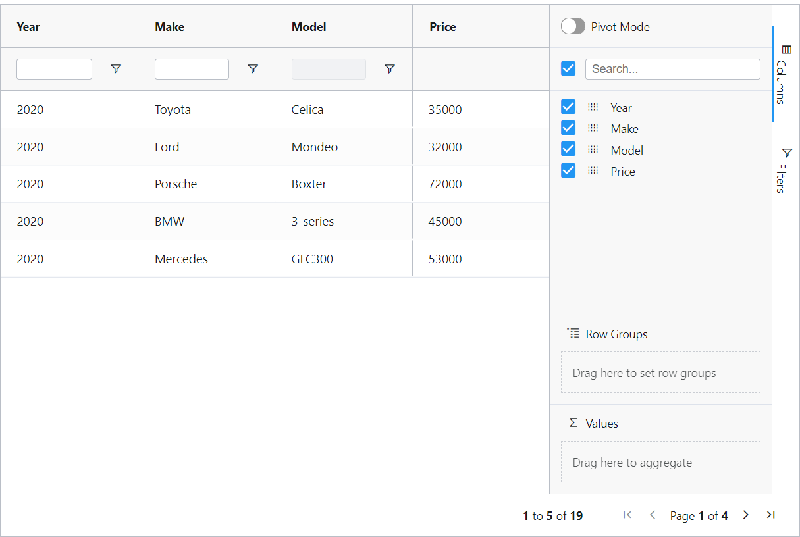
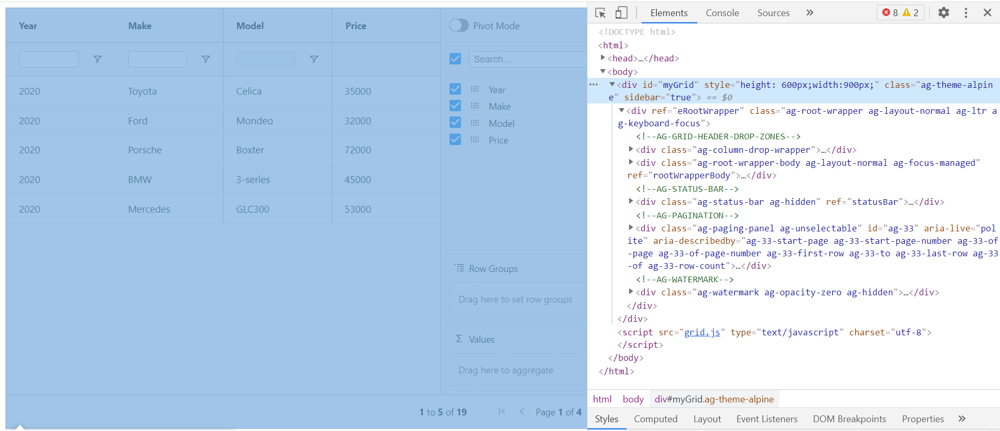
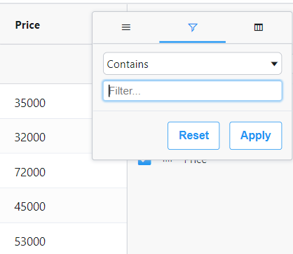

# cypress-ag-grid
Cypress plugin for interacting with and validating against ag grid.

## Table of Contents
  * [Installation](#installation)
  * [Usage](#usage)
    + [Grid Interaction]()
        - [Getting Data From the Grid](#getting-data-from-the-grid-)
        - [Getting Select Row Data](#getting-select-row-data)
        - [Sorting Columns](#sorting-columns)
        - [Filter by Text - Column Menu](#filter-by-text---column-menu)
        - [Filterby Text - Floating Filter](#filterby-text---floating-filter)
        - [Filter by Checkbox - Column Menu](#filter-by-checkbox---column-menu)
        - [Add or Remove Columns](#add-or-remove-columns)
    + [Grid Validation]()
        - [Validate Paginated Table](#validate-paginated-table)
        - [Validate Table in the Exact Order](#validate-table-in-the-exact-order)
        - [Validate Subset of Table Data](#validate-subset-of-table-data)
        - [Validate Empty Grid](#validate-empty-grid)
  * [Limitations](#limitations)
<br/>
<br/>
## Installation

```bash
npm install cypress-ag-grid --save-dev
```
Then include the following in your support/index.js file:

```javascript
import "cypress-ag-grid";
```
## Usage
Consider the ag grid example below:


With the following DOM structure:

<br/>
<br/>
### Getting Data From the Grid:
To get the Ag Grid data, you must chain `.getAgGridData()` after the `cy.get()` command for the topmost level of the grid, including controls and headers (see selected DOM element in above image).

Correct Usage:
```javascript
cy.get("#myGrid").getAgGridData()
```

Incorrect Usage:
```javascript
cy.getAgGridData();
```

The correct command will return the following:
```json
[
    { "Year": "2020", "Make": "Toyota", "Model": "Celica" },
    { "Year": "2020", "Make": "Ford", "Model": "Mondeo" },
    { "Year": "2020", "Make": "Porsche", "Model": "Boxter" },
    { "Year": "2020", "Make": "BMW", "Model": "3-series" },
    { "Year": "2020", "Make": "Mercedes", "Model": "GLC300" },
]
```
</br>
</br>

### Getting Select Row Data
To only get certain rows of data, pass the header values into the `getAgGridData()` command, like so:

```javascript
cy.get("#myGrid).getAgGridData({ onlyColumns: ["Year", "Make"] })
```

The above command will return the follwoing:
```json
[
    { "Year": "2020", "Make": "Toyota"},
    { "Year": "2020", "Make": "Ford"},
    { "Year": "2020", "Make": "Porsche"},
    { "Year": "2020", "Make": "BMW"},
    { "Year": "2020", "Make": "Mercedes"},
]
```
</br>
</br>

### Sorting Columns
This command will sort the specified column by the sort direction specified.

<b>Defintion</b>:
`.agGridSortColumn(columnName:String, sortDirection:String)`

Example:

```javascript
cy.get("#myGrid").agGridSortColumn("Model", "descending");
```
</br>
</br>

### Filter by Text - Column Menu
This command will filter a column by a text value from its menu. In the options, you must specify a `searchCriteria` objects containing one or more objects with `columnName`, `filterValue`, and optionally `operator` (i.e. Contains, Not contains, Equals, etc.).



<b>Definition:</b> `.agGridColumnFilterTextMenu(options: {})`

Example:
```javascript
cy.get("#myGrid").agGridColumnFilterTextMenu({
        searchCriteria:[{
            columnName: "Model",
            filterValue: "GLC300",
            operator:"Equals"
            },
            {
            columnName: "Make",
            filterValue: "Mercedes",
            operator:"Equals"
            }
        ],
    hasApplyButton: false
})
````
The above command will filter the Model column for the value 'GLC300' and set the filter operator to 'Equals'. It will then apply a secondary filter on the Make column for 'Mercedes'.
</br>
</br>
### Filterby Text - Floating Filter
This command will filter a column by a text value from its floating filter (if applicable).


<b>Definition:</b> .agGridColumnFilterTextMenu(options: {})

See [Filter by Text - Column Menu](#filter-by-Text---Column-Menu) for example and usage.
<br/>
</br>

### Filter by Checkbox - Column Menu
This command will filter a column by a checbkox text value from its menu.


Definition:
```javascript
.agGridColumnFilterCheckboxMenu(options={})
```

Example:
```javascript
    cy.get("#myGrid").agGridColumnFilterCheckboxMenu({
      searchCriteria: {
        columnName: "Model",
        filterValue: "2002",
      },
      hasApplyButton: true,
    });

```
</br>
</br>

### Add or Remove Columns
This command will toggle the specified column from the grid's sidebar.

<b>Definition:</b>`.agGridToggleColumnsSideBar(columnName:String, doRemove:boolean)`

Example:
```javascript
// This will remove the column "Year" from the grid
cy.get("#myGrid").agGridToggleColumnsSideBar("Year", true);
```
<br/>
<br/>

### Validate Paginated Table
This command will validate the paginated grid's data. The supplied expectedPaginatedTableData must be paginated as it's shown in the grid.

<b>Definition:</b> `agGridValidatePaginatedTable(expectedPaginatedTableData, onlyColumns = {})`

Example:
```javascript
    const expectedPaginatedTableData = [
      [
        { "Year": "2020", "Make": "Toyota", "Model": "Celica" },
        { "Year": "2020", "Make": "Ford", "Model": "Mondeo" },
        { "Year": "2020", "Make": "Porsche", "Model": "Boxter" },
        { "Year": "2020", "Make": "BMW", "Model": "3-series" },
        { "Year": "2020", "Make": "Mercedes", "Model": "GLC300" },
      ],
      [
        { "Year": "2020", "Make: "Honda", "Model": "Civic" },
        { "Year": "2020", "Make": "Honda", "Model": "Accord" },
        { "Year": "2020", "Make": "Ford", "Model": "Taurus" },
        { "Year": "2020", "Make": "Hyundai", "Model": "Elantra" },
        { "Year": "2020", "Make": "Toyota", "Model": "Celica" },
      ],
      ...other table data
    ];
    cy.get("#myGrid").agGridValidatePaginatedTable(
      expectedPaginatedTableData, onlyColumns ={"Year", "Make", "Model"}
    );
  });
```
<br/>
<br/>

### Validate Table in the Exact Order
This command will verify the table data is displayed exactly in the same order as the supplied expected table data. This will ONLY validate the first page of a paginated table.

<b>Definition</b>: `.agGridValidateRowsExactOrder(actualTableData, expectedTableData)`

Example:
```javascript
cy.get("#myGrid")
.getAgGridData()
.then((actualTableData) => {
    cy.get(agGridSelector).agGridValidateRowsExactOrder(actualTableData, expectedTableData);
});
```
<br/>
<br/>

### Validate Subset of Table Data
This command will validate a subset of the table data. Ideal for verifying one or more records, or verify records without specified columns.

<b>Definition:</b>: `agGridValidateRowsSubset(actualTableData, expectedTableData)`

Example:
```javascript
    const expectedTableData = [
      { "Year": "2020", "Make": "Toyota", "Model": "Celica" },
      { "Year": "2020", "Make": "Ford", "Model": "Mondeo" },
      { "Year": "2020", "Make": "Porsche", "Model": "Boxter" },
      { "Year": "2020", "Make": "BMW", "Model": "3-series" },
      { "Year": "2020", "Make": "Mercedes", "Model": "GLC300" },
    ];
    cy.get(agGridSelector)
      .getAgGridData({ onlyColumns: ["Year", "Make", "Model"] })
      .then((actualTableData) => {
        cy.get(agGridSelector).agGridValidateRowsSubset(actualTableData, expectedTableData);
      });
  });
```
<br/>
<br/>

### Validate Empty Grid
This will verify the table data is empty.

<b>Definition</b>:`agGridValidateEmptyTable(actualTableData, expectedTableData)`

Example:
```javascript
    cy.get(agGridSelector)
      .getAgGridData()
      .then((actualTableData) => {
        cy.get(agGridSelector).agGridValidateEmptyTable(actualTableData);
      });
```

## Limitations
* Unable to validate the entirety of an unlimited scrolling grid.
* Unable to validate data that is out of view. The DOM will register the ag grid data as it's scrolled into view.
  * To combat this, in your ag grid code set a check if the Cypress window is controlling the app and set the ag grid api to `.sizeColumnsToFit()`. Read more [here](https://www.ag-grid.com/javascript-grid/column-sizing/#size-columns-to-fit)
  * Example: 
  ```javascript
  if(Cypress.window){
      this.api.sizeColumnsToFit();
  }
  ``` 
